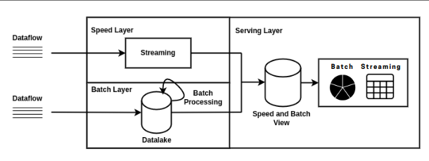

# BigDataBatch

This is a part of a big data project which encompasses both batch and data stream processing.
This java project is used for the batch processing where we do some operations on [911 calls dataset fire department](https://data.sfgov.org/Public-Safety/Fire-Department-Calls-for-Service/nuek-vuh3/data) according to our project architecture.


<p align="center">
  
</p>

> Note : you can check these two links for the rest of the project : 
> * [Data Stream Processing](https://github.com/HadilHelali/BigDataSpark)
> * [Visualization](https://github.com/RaouaTrimech/BigDataVisualisation)

For both components of the project, the execution of the generated Java applications will take place within an architecture consisting of three Docker containers. These containers serve specific roles, representing :
* **a master node (Namenode)** 
* **two slave nodes (Datanodes)**

each playing a crucial part in the overall functioning of the system.

**The master node (Namenode) container : hadoop-master** serves as the central control unit, overseeing the coordination and management of the distributed processing tasks. It takes charge of various responsibilities, such as tracking the location and metadata of the data stored across the slave nodes, managing access permissions, and orchestrating the overall data processing workflow.

On the other hand, **the two slave node (Datanode) containers : hadoop-slave1 , hadoop-slave2** serve as the distributed storage units, housing the actual data that is processed and analyzed. These nodes actively participate in the data processing pipeline, executing tasks assigned by the master node and providing the necessary resources for data storage and retrieval.

> Note : The following scripts should be run in **hadoop-master** after starting the docker container 
> ```
> ./start-hadoop.sh
> ```

### Dependencies 
This project have the following dependencies : 
* [Apache Hadoop](https://mvnrepository.com/artifact/org.apache.hadoop)
* [MongoDB Driver](https://mvnrepository.com/artifact/org.mongodb/mongo-java-driver)

### How to run it ?
1. generate the **JAR file** *(named BatchFireCalls-1.jar)* using a **maven run configuration** 
```
package clean install
```
2. copie the JAR file to the docker container **hadoop-master**
```
  docker cp target/BatchFireCalls-1.jar hadoop-master:/root
```
> Note : In **hadoop-master** , the dataset should be in the **HDFS** and it serves as an **input** for the java application.
> ```
> hadoop fs -put –put database.csv inputFireCalls
> ```
3. Create mongodb database and collection after installing `mongodb`
```
apt-get install mongodb 
mongo 
use 'fire-calls'
bd.createCollection('fire-calls-batch')
```
> Note : **mongo server** should be running in another ternimal :
> ```
> mongod
> ```
4. Run the JAR file in **hadoop-master** 
```
 hadoop jar BatchFireCalls-1.jar tn.insat.gl4.TotalCallsType inputFireCalls outputFireCalls
```
> Note : **mongo server** should be running in another ternimal when executing the JAR file :
> ```
> mongod
> ```
* To check if the resulted data has been stored in the database all you have to do is executing these commands in **hadoop-master** while still having the mongodb server up
```
mongo fire-calls
db['fire-calls-batch'].find()
```

## Collaborators 
| Raoua Trimech | Hadil Helali | Soulaima Kahla |
| ---- | ---- | ---- |
